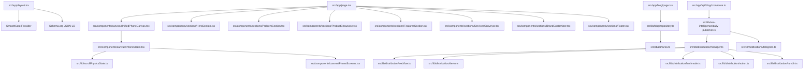

# Project Brain: Dependency Graph

## Component & Service Architecture Flow

```mermaid
graph TD
    AppLayout[src/app/layout.tsx] --> SmoothScroll[SmoothScrollProvider]
    AppLayout --> GlobalSchema[Schema.org JSON-LD]
    
    HomePage[src/app/page.tsx] --> PhoneCanvas[src/components/canvas/UnifiedPhoneCanvas.tsx]
    PhoneCanvas --> PhoneModel[src/components/canvas/PhoneModel.tsx]
    PhoneModel --> ScrollState[src/lib/scrollPhysicsState.ts]
    PhoneModel --> PhoneScreens[src/components/canvas/PhoneScreens.tsx]
    
    HomePage --> HeroSection[src/components/sections/HeroSection.tsx]
    HomePage --> ProblemSection[src/components/sections/ProblemSection.tsx]
    HomePage --> ProductShowcase[src/components/sections/ProductShowcase.tsx]
    HomePage --> FeaturesSection[src/components/sections/FeaturesSection.tsx]
    HomePage --> ServicesConveyor[src/components/sections/ServicesConveyor.tsx]
    HomePage --> BrandCustomizer[src/components/sections/BrandCustomizer.tsx]
    HomePage --> Footer[src/components/sections/Footer.tsx]
    
    BlogPage[src/app/blog/page.tsx] --> BlogRepo[src/lib/blog/repository.ts]
    BlogRepo --> TursoDB[src/lib/db/turso.ts]
    
    CronRoute[src/app/api/blog/cron/route.ts] --> DailyPublisher[src/lib/seo-intelligence/daily-publisher.ts]
    DailyPublisher --> DistManager[src/lib/distribution/manager.ts]
    DistManager --> Webflow[src/lib/distribution/webflow.ts]
    DistManager --> DevTo[src/lib/distribution/devto.ts]
    DistManager --> Hashnode[src/lib/distribution/hashnode.ts]
    DistManager --> Notion[src/lib/distribution/notion.ts]
    DistManager --> Tumblr[src/lib/distribution/tumblr.ts]
    DailyPublisher --> Telegram[src/lib/notifications/telegram.ts]
```
